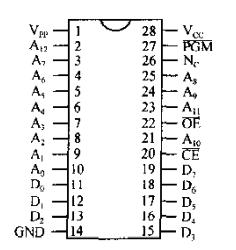
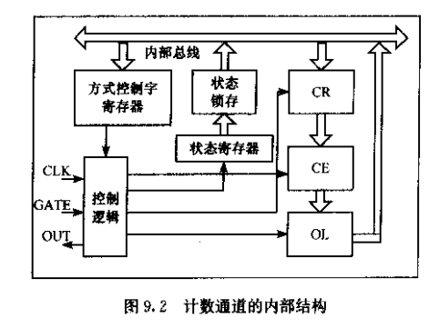

# 目前进度
1. 老教材复习 ok
2. 真题
    - 2010 DONE
    - 2011~ DOING


# 汇编语言程序设计
## 寄存器
1. 数据寄存器 4*16 or 8*8
   1. AX[AH|AL] 累加器
   2. BX[BH|BL] 基地址指针
   3. CX[CH|CL] 计数寄存器
   4. DX[CH|CL] 数据寄存器
2. 地址指针和变址寄存器
   1. SI 源变址寄存器
   2. DI 目的变址寄存器
   3. SP 堆栈指针
   4. BP 基址指针
3. 段寄存器
   1. DS 数据段寄存器
   2. ES 附加数据段寄存器
   3. SS 堆栈段寄存器
   4. CS 代码段寄存器
4. 指令指针 IP
5. 标志寄存器 FLAG 

## 寻址方式
1. 立即寻址
    - MOV AX, 10H; 立即数只能作为SRC操作数
2. 寄存器寻址
    - MOV AX, BX
    - MOV CL, AH

存储器寻址： 

3. 直接寻址
    - MOV AX, [2000H]; DS:2000H
    - MOV AX, ES:[500H]
    - MOV AX, AREA1
4. 寄存器间接寻址 ([REG16])
    - 可用寄存器(默认段地址为DS)
      - BX
      - SI
      - DI
    - MOV AX, [SI]
5. 寄存器相对寻址 ([REG16] + 8/16 disp)
    - 可用寄存器
      - DS段
        - BX
        - SI
        - DI
      - SS段
        - BP
    - MOV AX, [BP]; (AX)<-(SS:BP)
    - MOV AX, COUNTA[BX]; (AX)<-(DS:(BX+COUNTA))
    - MOV AX, [BX]+6
    - MOV AX, [BX+6]
6. 基址变址寻址 (DS:[BX][SI] or SS:[BP][DI])
    - MOV AX, [BX][SI]
    - MOV AX, [BP][DI]
7. 基址变址相对寻址 (DS:[BX][SI]+disp or SS:[BP][DI]+disp)
    - MOV AX, COUNTA[BX][SI]
    - MOV AX, [BP][DI]
其他寻址方式
8. 隐含寻址
    - 指令中不指明操作数，但有隐含规定的寻址方式
9.  I/O端口寻址
    - 直接端口 0~FFH
      - IN AL, 10H
      - OUT 10H, AL
    - 间接端口 0~FFFFH
      - IN AL, DX
      - OUT DX, AL
10. 一条指令有多种寻址方式
    - MOV [BX], AL; DST-寄存器间接寻址 SRC-寄存器寻址
11. 转移类指令寻址
## 转移地址寻址方式


## 指令
### 数据传送指令

1. MOV 通用数据传送指令
    - MOV DST, SRC; (DST)<-(SRC)
2. LEA 取有效地址指令
    - LEA REG16, MEM; (REG16)<-(OFFSET MEM)
3. LDS 将双字指针送到寄存器和DS指令
    - LDS REG16, MEM; (DS)<-(MEM+2), REG16<-(MEM)
4. LES 将双字指针送到寄存器和ES指令
    - LES REG16, MEM; (ES)<-(MEM+2), REG16<-(MEM)
5. LAHF 标志送到AH指令
    - LAHF; (AH)<-FLAG寄存器低8位
6. SAHF AH送标志寄存器
    - SAHF; FLAG寄存器低8位<-(AH)
7. XCHG 交换指令
    - XCHG DST, SRC; DST<->SRC
8. XLAT 表转换指令
    - XLAT; (AL)<-((BX)+(AL))
9. PUSH 进栈指令
    - PUSH SRC; SRC压栈, (SP)<-(SP)-2
10. POP 出栈指令
    - POP DST; 从堆栈弹出一个字至DST, (SP)<-(SP)+2
11. PUSHF 标志入栈指令
    - PUSHF; FLAG压栈, (SP)<-(SP)-2
12. POPF 标志出栈指令
    - POPF; 从堆栈弹出一个字至FLAG, (SP)<-(SP)+2
13. IN 输入指令
    - IN AL/AX, PORT; 0~FFH
    - IN AL/AX, DX; 0~FFFFH
14. OUT 输出指令
    - OUT PORT, AL/AX
    - OUT DX, AL/AX

### 算术运算指令
#### 加法
1. ADD 加法指令
    - ADD DST, SRC; (DST)<-(DST)+(SRC)
2. ADC 带进位的加法指令
    - ADD DST, SRC; (DST)<-(DST)+(SRC)+(CF)
3. INC 增量指令
    - INC DST; (DST)<-(DST)+1
    - **<big>不影响CF标志位</big>**
4. AAA 加法的ASCII调整指令（分离BCD数）
    - AAA;
5. DAA 加法的十进制调整指令（组合BCD数）
    - DAA;
#### 减法
1. SUB 减法指令
    - SUB DST, SRC; (DST)<-(DST)-(SRC)
2. SBB 带借位的减法指令
    - SBB DST, SRC; (DST)<-(DST)-(SRC)-(CF)
3. CMP 比较指令
    - CMP DST, SRC; (DST)-(SRC), 设置FLAG
4. DEC 减量指令
    - DEC DST; (DST)<-(DST)-1
    - **<big>不影响CF标志位</big>**
5. NEG 取负指令
    - NEG DST; (DST)<-0-DST
    - 正常影响6个标志位
6. AAS 减法的ASCII调整指令(分离BCD数)
    - AAS;
7. DAS 减法的十进制调整指令(组合BCD数)
    - DAS;

#### 乘法
1. MUL 无符号数乘法指令
    - MUL SRC;
      - SRC为字节 (AX)<-(AL)*(SRC)
      - SRC为字 (DX)(AX) <- (AX)*(SRC)
    - **FLAG <big>只对CF和OF有影响</big>**
      - CF=0, OF=0 高半部无效
      - CF=1, OF=1 高半部有效
2. IMUL 整数除法指令
    - IMUL SRC;
      - SRC为字节 (AX)<-(AL)*(SRC)
      - SRC为字 (DX)(AX) <- (AX)*(SRC)
    - **FLAG <big>只对CF和OF有影响</big>**
      - CF=0, OF=0 高半部无效
      - CF=1, OF=1 高半部有效
3. AAM 乘法的ASCII调整指令
    - AAM;
    - **FLAG <big>影响ZF SF</big>**

#### 除法
1. DIV 无符号数除法指令
    - DIV SRC;
      - SRC为字节 (AH 余数)(AL 商)<-(AX)/(SRC)
      - SRC为字 (DX 余数)(AX 商)<-(DX)(AX)/(SRC)
2. IDIV 整数除法指令
    - DIV SRC;
      - SRC为字节 (AH 余数)(AL 商)<-(AX)/(SRC)
      - SRC为字 (DX 余数)(AX 商)<-(DX)(AX)/(SRC)
3. AAD 除法的ASCII调整指令
    - AAD;
    - 需要在除法运算之前调整
    - **FLAG <big>影响PF SF ZF</big>**
4. CBW 字节转换位字指令（字节扩展）
    - CBW; (AL)--扩展->(AX) **高位跟从符号位**
    - **<big>不影响标志位</big>**
5. CWD 字转换为双字指令（字扩展）
    - CWD; (AX)--扩展->(DX)(AX) **高位跟从符号位**
    - **<big>不影响标志位</big>**

### 逻辑运算
1. AND 逻辑与指令
    - AND DST, SRC; (DST)<-(DST)^(SRC)
    - 保留/清除特定位
    - **<big>CF,OF清零 ZR,SF,PF反应操作结果 AF未定义</big>**
2. TEST 测试指令
    - TEST DST, SRC; (DST)^(SRC)
    - **<big>CF,OF清零 ZR,SF,PF反应操作结果 AF未定义</big>**
3. OR 逻辑或指令
    - OR DST, SRC; (DST)<-(DST)V(SRC)
    - 特定位置1
    - **<big>CF,OF清零 ZR,SF,PF反应操作结果 AF未定义</big>**
4. XOR 异或操作指令
    - XOR DST, SRC; (DST)<-(DST)⊕(SRC)
    - 特定位取反
    - **<big>CF,OF清零 ZR,SF,PF反应操作结果 AF未定义</big>**
5. NOT 取反指令
    - NOT DST; (DST) <- (DST按位取反)
    - FLAG 无意义

### 移位指令


### 字符串处理指令
字符串通用：
- 操作的实际地址由DS:SI及ES:DI提供
- 指令后缀B或者W 以及DST, SRC只是提供类型
- DF
  - 0-SI/DI增加
  - 1-SI/DI减小
- SI/DI
  - 字操作 变量为2
  - 字节操作 变量为1
- 重复前缀
  - REP
    - MOVS
    - LODS
    - STOS
  - REPZ/REPE
    - SCAS
    - CMPS
  - REPNZ/REPNE
    - CMPS
    - SCAS

1. MOVS 字符串传送指令
    - MOVS DST, SRC;
2. CMPS 字符串比较指令
    - CMPS DST, SRC;
    - **<big>(SRC)-(DST)->FLAG!!!</big>**
    - **<big>与CMP指令的减法顺序相反</big>**
3. SCAS 字符串扫描指令
    - SCAS DST; 
      - 字节操作
        - (AL)-(ES:DI), (DI)<-(DI)±1
      - 字操作
        - (AX)-(ES:DI), (DI)<-(DI)±2
4. LODS 数据串装入指令
    - LODS SRC;
      - 字操作
        - (AL)<-(DS:SI), (SI)<-(SI)±1
      - 字节操作
        - (AX)<-(DS:SI), (SI)<-(SI)±2
5. STOS 数据串存储指令
    - STO DST;
      - 字操作
        - (ES:DI)<-(AL), (DI)<-(DI)±1
      - 字节操作
        - (ES:DI)<-(AX), (DI)<-(DI)±2

### 控制转移指令
#### 无条件转移和过程调用指令
1. JMP 无条件转移指令
    - JMP 标号
2. CALL 过程调用指令
    - CALL PROCNAME;
      - 下一条指令的IP入栈 SP=SP-2
      - 若为远端 下一条指令的CS入栈 SP=SP-2
      - 转到子程序入口
3. RET 返回指令
    - RET;
      - 压栈保护的CS/IP弹出，返回主程序继续运行

#### 条件转移


#### 条件循环控制
1. LOOP
    - LOOP 标号; CX≠0执行 CX=CX-1
2. LOOPE/LOOPZ
    - LOOPZ 标号; CX≠0, ZF=0执行 CX=CX-1
3. LOOPNE/LOOPNZ
    - LOOPNZ 标号; CX≠0, ZF≠0执行 CX=CX-1
4. JCXZ
    - JCXZ 标号; CX=0执行

#### 中断
1. INT 软件中断指令
    - INT N;
2. INTO 溢出中断指令
    - INTO; OF=1时可由该指令触发类型为4的中断
3. IRET 中断返回指令

#### 处理器控制指令
1. 标志操作指令

2. 外部同步指令
   1. ESC 换码指令
   2. WAIT 等待指令
   3. LOCK 封锁总线指令
3. 停机指令和空操作指令
   1. HLT 停机指令
        - 结束停机方式：
            1. RESET复位信号
            2. NMI引脚中断信号
            3. IF=1 INTR引脚中断信号
   2. NOP 空操作指令
        - 耗费3个时钟周期，不完成任何操作

## 伪指令
1. 段定义语句
   - 代码段
    ```masm
    ; 段定义语句
    SEGM SEGMENT [定位类型] [组合类型] ['分类名']
        ...
        ...
    SEGM ENDS
    ```
    - 定位类型
    - PAGE 256
    - *PARA 16 默认
    - WORD 2
    - BYTE 1
    - 组合类型
    - *NONE 默认
    - STACK
    - PUBLIC
    - COMMON
    - AT
    - MEMORY
    - 分类名 所有类型名相同的逻辑段组成一个段组
2. ASSUME 段分配语句
    - ASSUME CS:CODE, DS:DATA, ES:DATA, SS:STACK
    - ASSUME ES:NOTHING; 取消段分配
3. 过程定义语句
```masm
过程名 PROC [NEAR]/FAR
    ....
    ....
过程名 ENDP
```
4. 变量定义语句
    - 伪指令指示符
      - DB 字节
      - DW 字
      - DD 双字
      - DQ 4字
      - DT 10字节
      - DUP 重复变量
```masm
FIRST DB ?
SECOND DB 20H, 33H
THIRD DW 1122H, 3344H
FOUR DD 12345678H
N1 DB 100 DUP(?)
```
5. 程序结束语句
    - END [标号名或名字]
6. 其他伪指令
    1. EQU 等真值伪指令
        - NUM EQU 2
    2. LABEL 定义类型伪指令
        - NUM LABEL BYTE 
        - 名称 LABEL 类型
    3. EVEN 对准伪指令
        - 将下一语句所指向的地址调整为偶地址 
    4. ORG 伪指令
        - 为下一条语句指定偏移地址
    5. PUBLIC
        - PUBLIC A1,A2,SUBRT; A1,A2,SUBRT可公用
        - 公开声明 其他模块可调用相应变量
    6. EXTRA
        - EXTRA A1:BYTE, A2:WORD, SUBRT:FAR
        - 其他模块用PUBLIC定义过的变量可供本模块使用

## 表达式和运算符


# 8086/8088接口电路设计
## 常用芯片
### 74LS244 8位数据单向缓冲器

<table>
    <tr>
        <th>G#</th>
        <th>A</th>
        <th>Y</th>
    </tr>
    <tr>
        <td>0</td>
        <td>0</td>
        <td>0</td>
    </tr>
    <tr>
        <td>0</td>
        <td>1</td>
        <td>1</td>
    </tr>
    <tr>
        <td>1</td>
        <td>X</td>
        <td>三态</td>
    </tr>
</table>


### 74LS245 8位数据双向缓冲器

<table>
    <tr>
        <th>G#(E#)</th>
        <th>DIR</th>
        <th>方向</th>
    </tr>
    <tr>
        <td>0</td>
        <td>0</td>
        <td>A<-B</td>
    </tr>
    <tr>
        <td>0</td>
        <td>1</td>
        <td>A->B</td>
    </tr>
    <tr>
        <td>1</td>
        <td>X</td>
        <td>三态</td>
    </tr>
</table>


### 74LS373 8位锁存器

<table>
    <tr>
        <th>OE#</th>
        <th>G</th>
        <th>D</th>
        <th>Q</th>
    </tr>
    <tr>
        <td>0</td>
        <td>0</td>
        <td>0</td>
        <td>0</td>
    </tr>
    <tr>
        <td>0</td>
        <td>0</td>
        <td>1</td>
        <td>1</td>
    </tr>
    <tr>
        <td>0</td>
        <td>1</td>
        <td>X</td>
        <td>保持</td>
    </tr>
    <tr>
        <td>1</td>
        <td>X</td>
        <td>X</td>
        <td>为高阻</td>
    </tr>
</table>


### 74LS374 8位锁存器

<table>
    <tr>
        <th>OE#</th>
        <th>cp</th>
        <th>D</th>
        <th>Q</th>
    </tr>
    <tr>
        <td>0</td>
        <td>上升沿*</td>
        <td>0</td>
        <td>0</td>
    </tr>
    <tr>
        <td>0</td>
        <td>上升沿*</td>
        <td>1</td>
        <td>1</td>
    </tr>
    <tr>
        <td>0</td>
        <td>其他</td>
        <td>X</td>
        <td>保持</td>
    </tr>
    <tr>
        <td>1</td>
        <td>X</td>
        <td>X</td>
        <td>为高阻</td>
    </tr>
</table>


### 8288 总线控制器


### 8284A 时钟发生器


### 74LS138 专用译码器(3-8)

- 真值表
<table>
    <tr>
        <th colspan="3">片选端</th>
        <th colspan="3">输入端</th>
        <th colspan="3">有效输出端</th>
    </tr>
    <tr>
        <th>G1</th>
        <th>G2A#</th>
        <th>G2B#</th>
        <th>C</th>
        <th>B</th>
        <th>A</th>
        <th colspan="3">Y0#~Y7#</th>
    </tr>
    <tr>
        <td>1</td>
        <td>0</td>
        <td>0</td>
        <td>0</td>
        <td>0</td>
        <td>0</td>
        <td colspan="3">Y0#=0, 其余Y#为1</td>
    </tr>
    <tr>
        <td>1</td>
        <td>0</td>
        <td>0</td>
        <td>0</td>
        <td>0</td>
        <td>1</td>
        <td colspan="3">Y1#=0, 其余Y#为1</td>
    </tr>
    <tr>
        <td>1</td>
        <td>0</td>
        <td>0</td>
        <td>0</td>
        <td>1</td>
        <td>0</td>
        <td colspan="3">Y2#=0, 其余Y#为1</td>
    </tr>
    <tr>
        <td>1</td>
        <td>0</td>
        <td>0</td>
        <td>0</td>
        <td>1</td>
        <td>1</td>
        <td colspan="3">Y3#=0, 其余Y#为1</td>
    </tr>
    <tr>
        <td>1</td>
        <td>0</td>
        <td>0</td>
        <td>1</td>
        <td>0</td>
        <td>0</td>
        <td colspan="3">Y4#=0, 其余Y#为1</td>
    </tr>
    <tr>
        <td>1</td>
        <td>0</td>
        <td>0</td>
        <td>1</td>
        <td>0</td>
        <td>1</td>
        <td colspan="3">Y5#=0, 其余Y#为1</td>
    </tr>
    <tr>
        <td>1</td>
        <td>0</td>
        <td>0</td>
        <td>1</td>
        <td>1</td>
        <td>0</td>
        <td colspan="3">Y6#=0, 其余Y#为1</td>
    </tr>
    <tr>
        <td>1</td>
        <td>0</td>
        <td>0</td>
        <td>1</td>
        <td>1</td>
        <td>1</td>
        <td colspan="3">Y7#=0, 其余Y#为1</td>
    </tr>
</table>


## 8086的引脚功能和时序
### 8086引脚


<table>
    <tr>
        <th>引脚</th>
        <th>方向</th>
        <th>工作方式[0:小 1:大 X:无影响]</th>
        <th>功能</th>
        <th>备注</th>
    </tr>
    <tr>
        <td>GND</td>
        <td>X</td>
        <td>X</td>
        <td>接地</td>
        <td></td>
    </tr>
    <tr>
        <td>Vcc</td>
        <td>X</td>
        <td>X</td>
        <td>+5V电源</td>
        <td></td>
    </tr>
    <tr>
        <td>MN/MX#</td>
        <td>输入</td>
        <td>X</td>
        <td>工作方式选择</td>
        <td>接地-最大 接电源-最小</td>
    </tr>
    <tr>
        <td>CLK</td>
        <td>输入</td>
        <td>X</td>
        <td>时钟信号输入</td>
        <td>总线周期为4个时钟周期</td>
    </tr>
    <tr>
        <td>RESET</td>
        <td>输入</td>
        <td>X</td>
        <td>系统复位信号</td>
        <td>
            高电平有效 有效信号至少保持4个时钟周期<br>
            RESET信号有效时 CPU清除IP DS ES SS PSW和指令队列为0并置CS为0FFFFH,
            信号结束后CPU从存储器的0FFFF0H地址开始读取和执行指令
        </td>
    </tr>
    <tr>
        <td>AD15~AD0</td>
        <td>输入/输出/三态</td>
        <td>X</td>
        <td>地址、数据总线</td>
        <td>
            分时复用-在执行存储器读写或IO输入输出操作的总线周期T1状态时作为地址总线A15~A0 16位地址，
            其他T时作为双向数据总线输入或输出D15~D0 16位数据
        </td>
    </tr>
    <tr>
        <td>A19/S6~A16/S3</td>
        <td>输出/三态</td>
        <td>X</td>
        <td>地址、状态信号线</td>
        <td>
            分时复用-在[存储器读写操作]总线周期的T1状态输出高4位地址A19~A16，
            其他T时输出状态信息，S6始终低电平，S5是PSW的IF，S4和S3表示选中的段REG
        </td>
    </tr>
    <tr>
        <td>ALE</td>
        <td>输出</td>
        <td>0</td>
        <td>地址锁存允许信号</td>
        <td>ALE信号有效时，表示地址线上的信息有效</td>
    </tr>
    <tr>
        <td>DEN#</td>
        <td></td>
        <td>0</td>
        <td>数据允许信号</td>
        <td>低电平有效，允许CPU发送或接收数据</td>
    </tr>
    <tr>
        <td>DT/R</td>
        <td>输出/三态</td>
        <td>0</td>
        <td>数据收发信号</td>
        <td>低电平-CPU接受数据 高电平-CPU发送数据</td>
    </tr>
    <tr>
        <td>WR#</td>
        <td>输出/三态</td>
        <td>0</td>
        <td>写信号</td>
        <td>低电平-正在执行存储器或IO端口的输出操作</td>
    </tr>
    <tr>
        <td>RD#</td>
        <td>输出/三态</td>
        <td>X</td>
        <td>读信号</td>
        <td>低电平-正在执行存储器或IO端口的输入操作</td>
    </tr>
    <tr>
        <td>M/IO#</td>
        <td>输出/三态</td>
        <td>0</td>
        <td>访问类别</td>
        <td>高电平-存储器 低电平-IO</td>
    </tr>
    <tr>
        <td>READY</td>
        <td>输入</td>
        <td>X</td>
        <td>准备好信号</td>
        <td>来自存储器或IO的应答信号 高电平有效<br>
            CPU在T3开始检查READY 弱为低电平则插入Twait进行等待
        </td>
    </tr>
    <tr>
        <td>TEST#</td>
        <td>输入</td>
        <td>X</td>
        <td>测试信号</td>
        <td>执行WAIT指令 每5T检测TEST#引脚 若为低电平则执行下一条指令 若为高电平则继续等待5T</td>
    </tr>
    <tr>
        <td>BHE#/S7</td>
        <td>输出/三态</td>
        <td>X</td>
        <td>高8位总线允许/状态信号</td>
        <td>S7无定义 BHE#和A0组合代表不同的数据引脚使用</td>
    </tr>
    <tr>
        <td>NMI</td>
        <td>输入</td>
        <td>X</td>
        <td>外部非可屏蔽中断请求输入信号</td>
        <td>上升沿有效 CPU执行完当前指令后立即进行中断处理</td>
    </tr>
    <tr>
        <td>INTR</td>
        <td>输入</td>
        <td>X</td>
        <td>外部可屏蔽中断请求输入信号</td>
        <td>CPU在每条指令的最后1T对INTR进行测试，决定当前指令执行完后是否响应中断--IF标志位</td>
    </tr>
    <tr>
        <td>INTA#</td>
        <td>输出</td>
        <td>0</td>
        <td>中断响应信号</td>
        <td>INTR受到中断请求信号后，IF=1时CPU响应中断，在相邻的两个总线周期中输出两个负脉冲(T2-T4)</td>
    </tr>
    <tr>
        <td>HOLD</td>
        <td>输入</td>
        <td>0</td>
        <td>总线申请信号</td>
        <td>其他总线主控设备向CPU请求总线使用权，高电平有效</td>
    </tr>
    <tr>
        <td>HLDA</td>
        <td>输出</td>
        <td>0</td>
        <td>总线使用权应答信号</td>
        <td>CPU让出总线使用权发出该信号，所有三态引脚处于高阻状态与外部隔离<br>
        CPU在T4之前或在T1受到一个HOLD信号，则CPU发出HLDA
        </td>
    </tr>
    <tr>
        <td>QS1<br>QS0</td>
        <td>输出</td>
        <td>1</td>
        <td>指令队列状态输出线</td>
        <td>提供8086内部指令队列的状态</td>
    </tr>
    <tr>
        <td>S2#<br>S1#<br>S0#</td>
        <td>输出/三态</td>
        <td>1</td>
        <td>状态信号输出线</td>
        <td>表示CPU当前总线周期的操作类型*</td>
    </tr>
    <tr>
        <td>LOCK#</td>
        <td>输出/三态</td>
        <td>1</td>
        <td>总线锁定信号</td>
        <td>低电平有效</td>
    </tr>
    <tr>
        <td>RQ#/GT1#<br>RQ#/GT0#</td>
        <td>输入/出</td>
        <td>1</td>
        <td>输入总线请求信号/输出总线授权信号</td>
        <td>低电平有效，不同处理器之间连接控制用，GT0#优先级高于GT1#</td>
    </tr>
</table>

### 8086特殊引脚详情

- S4/S3
  - 真值表
  - <table>
        <tr>
            <th>S4</th>
            <th>S3</th>
            <th>段寄存器</th>
        </tr>
        <tr>
            <td>0</td>
            <td>0</td>
            <td>ES</td>
        </tr>
        <tr>
            <td>0</td>
            <td>1</td>
            <td>SS</td>
        </tr>
        <tr>
            <td>1</td>
            <td>0</td>
            <td>CS(或I/O，中断响应)</td>
        </tr>
        <tr>
            <td>1</td>
            <td>1</td>
            <td>DS</td>
        </tr>
    </table>
- BHE#/S7
  - BHE#和A0的不同组合状态真值表
  - <table>
        <tr>
            <th>操作</th>
            <th>BHE#</th>
            <th>A0</th>
            <th>使用的数据引脚</th>
        </tr>
        <tr>
            <td>读或写偶地址的一个字</td>
            <td>0</td>
            <td>0</td>
            <td>AD15~AD0</td>
        </tr>
        <tr>
            <td>读或写偶地址的一个字节</td>
            <td>1</td>
            <td>0</td>
            <td>AD7~AD0</td>
        </tr>
        <tr>
            <td>读或写奇地址的一个字节</td>
            <td>0</td>
            <td>1</td>
            <td>AD15~AD8</td>
        </tr>
        <tr>
            <td>读或写奇地址的一个字</td>
            <td>0</td>
            <td>1</td>
            <td>AD15~AD8<br>(第一个总线周期放低位数据字节)</td>
        </tr>
        <tr>
            <td>接上方操作</td>
            <td>1</td>
            <td>0</td>
            <td>AD7~AD0<br>(第二个总线周期放高位数据字节)</td>
        </tr>
    </table>
- INTA#
  - 时序图
  - 
  - 1-T1
    - ALE高电平 锁存地址找到8259A
  - 1-T2
    - ALE低电平
    - INTA#发出第一次负脉冲
  - 2-T1
    - ALE高电平
  - 2-T2
    - INTA#第二次负脉冲
    - AD7~AD0输出中断类型号

### 8086最大工作方式特殊引脚
- QS1/QS0
  - 指令队列输出线
  - 真值表
  - <table>
        <tr>
            <th>QS1</th>
            <th>QS0</th>
            <th>指令队列状态</th>
        </tr>
        <tr>
            <td>0</td>
            <td>0</td>
            <td>无操作 队列中指令未被取出</td>
        </tr>
        <tr>
            <td>0</td>
            <td>1</td>
            <td>从队列中取出当前指令的第一字节</td>
        </tr>
        <tr>
            <td>1</td>
            <td>0</td>
            <td>队列空</td>
        </tr>
        <tr>
            <td>1</td>
            <td>1</td>
            <td>从队列中取出指令的后续字节</td>
    </table>
- ** S2#/S1#/S0#
  - 状态信号输出线
  - 对接8288 输出真值表
  - <table>
        <tr>
            <th>S2#</th>
            <th>S1#</th>
            <th>S0#</th>
            <th>操作状态</th>
            <th>8288产生的信号</th>
        </tr>
        <tr>
            <td>0</td>
            <td>0</td>
            <td>0</td>
            <td>中断响应</td>
            <td>INTA#</td>
        </tr>
        <tr>
            <td>0</td>
            <td>0</td>
            <td>1</td>
            <td>读IO端口</td>
            <td>IORC#</td>
        </tr>
        <tr>
            <td>0</td>
            <td>1</td>
            <td>0</td>
            <td>写IO端口</td>
            <td>IOWC#,AIOWC#</td>
        </tr>
        <tr>
            <td>0</td>
            <td>1</td>
            <td>1</td>
            <td>暂停</td>
            <td>无</td>
        </tr>
        <tr>
            <td>1</td>
            <td>0</td>
            <td>0</td>
            <td>取指令</td>
            <td>MRDC#</td>
        </tr>
        <tr>
            <td>1</td>
            <td>0</td>
            <td>1</td>
            <td>读存储器</td>
            <td>MRDC#</td>
        </tr>
        <tr>
            <td>1</td>
            <td>1</td>
            <td>0</td>
            <td>写存储器</td>
            <td>MWTC#,AMWC#</td>
        </tr>
        <tr>
            <td>1</td>
            <td>1</td>
            <td>1</td>
            <td>保留</td>
            <td>无</td>
        </tr>
    </table>

### 8088特殊引脚
- MEMR#
  - 存储器读控制信号
- MEMW#
  - 存储器写控制信号
- IOR#
  - IO端口读控制信号
- IOW#
  - IO端口写控制信号
- AEN
  - 输出
  - 控制信号
  - IO操作时为0！！！
- IO/M#
  - 与8086的M/IO#相反

### 8086/8088工作方式详解
#### 8086最小方式读总线周期

- T1
  - ALE高电平 ADRESS LOCK ENABLE地址锁存允许
  - AD15~AD0 地址输出
  - AD19/S3~AD16/S6 地址输出
  - BHE#/S7 BHE#输出
  - DT/R# 低电平 数据流向由外部设备至CPU
  - RD# 高电平
  - M/IO# 高电平-存储器操作、低电平-IO操作
  - DEN# 高电平 当前为地址数据 不允许
- T2
  - ALE变为低电平
  - AD19/S3~AD16/S6 状态输出
  - DEN#变为低电平 数据允许
  - RD# 低电平 读信号
  - AD15~AD0 数据输出
- T4
  - RD# 变为高电平
  - AD15~AD0 A19/S3~A6/S6 数据输入/状态输出结束
  - DT/R# 根据下个总线周期改变
  - DEN#变为高电平
  - M/IO# 根据下个总线周期改变

#### 8086最小方式写总线周期

大致跟读周期相同，RD#换为WR#,DT/R#反向


#### 8086最大方式读、写总线周期
- DEN#,DEN#,ALE由8288提供，取代CPU直接提供
- MEMR#或IOR#取代M/IO#和RD#
- MEMW#或IOW#取代M/IO#和WR#


## 8086系统配置
### 8086最小模式系统配置图
- 详细版

- 简单版


### 8086最大模式系统配置图
- 详细版

- 简单版


### 8088/PCXT系统配置图
- 8088最小简单版

- 8088最大简单版

- PCXT


## 存储器概念
- 存储器分类
  - ROM READ ONLY MEMORY
  - RAM RANDOM ACCESS MEMORY
- 技术指标
  - 存储容量
  - 读写速度
  - 非易失性
  - 可靠性
- 存储器芯片速度估算
  - Tcyc(R) < 4T - t(da) - t(D) - T
    - Tcyc(R)： READ CYCLE TIME
    - T: CLK周期
    - t(da): 地址总线延时时间
    - t(D): 其他延时时间总和

## 常用存储芯片
### SRAM 6264

- 64/8=8KB=2^13
- 引脚
  - A0~A12 地址输入
  - D0~D7 数据输入/输出
  - CS1# 片选信号
  - CS2 片选信号
  - OE# 输出允许信号
  - WE# 写允许信号
- 引脚真值表
  - <table>
        <tr>
            <th>CS1#</th>
            <th>CS2</th>
            <th>OE#</th>
            <th>WE#</th>
            <th>数据引脚</th>
        </tr>
        <tr>
            <td>1</td>
            <td>X</td>
            <td>X</td>
            <td>X</td>
            <td>高阻态</td>
        </tr>
        <tr>
            <td>X</td>
            <td>0</td>
            <td>X</td>
            <td>X</td>
            <td>高阻态</td>
        </tr>
        <tr>
            <td>0</td>
            <td>1</td>
            <td>1</td>
            <td>0</td>
            <td>输出</td>
        </tr>
        <tr>
            <td>0</td>
            <td>1</td>
            <td>0</td>
            <td>1</td>
            <td>输入</td>
        </tr>
        <tr>
            <td>0</td>
            <td>1</td>
            <td>1</td>
            <td>1</td>
            <td>高阻态</td>
        </tr>
    </table>

### SRAM 2114 


- 14 = 1KB*4 1K=2^10
- 引脚
  - A0~A9 地址输入
  - D0~D3 数据输入/出
  - WE# 写允许信号
  - CS# 片选信号
- 真值表
  - <table>
        <tr>
            <th>CS#</th>
            <th>WE#</th>
            <th>数据引脚</th>
        </tr>
        <tr>
            <td>0</td>
            <td>0</td>
            <td>输入存储器</td>
        </tr>
        <tr>
            <td>0</td>
            <td>1</td>
            <td>存储器输出至总线</td>
        </tr>
        <tr>
            <td>1</td>
            <td>X</td>
            <td>高阻态</td>
        </tr>
    </table>


### EPROM 2764

- 64 = 8KB*8 8K = 2^13
- 引脚
  - A0~A12 地址输入
  - D0~D7 数据输入/输出
  - OE# 输出允许信号
  - CE# 片选
  - Vpp 编程电压输入端 常见+12.5V
  - PGM# 编程脉冲输入端
    - EPROM编程时该端加上50ms+-5ms的负脉冲
    - 读操作时PGM#=1


## 地址译码电路
- 全地址
- 部分地址
  - 电路简单
  - 省硬件
  - 浪费空间
- 需要对接的线路
  - 地址线
  - M/IO#(8086最小)
  - IO/M#(8088最小)
  - MEMR#和MEMW#(8086/8088最大工作方式/PCXT)
  - AEN(PCXT*)

## 扩展存储器接口电路设计
### 存储器位扩展

### 存储器字节扩展

### 存储器字节+位扩展

### 8088+6264组成的存储电路

### 存储器自检程序
```asm
; CS段
; 写 0101 0101B/ 1010 1010B检测粘连故障
    MOV SI, 0
    MOV CX, 16*1024; 存储空间大小
    MOV BX, 8000H; 存储地址起始
    MOV DS, BX
    MOV AL, 01010101B
L1: 
    MOV [SI], AL
    MOV AH, [SI]
    CMP AH, AL
    JNE FAIL
    INC SI
    LOOP L1

    MOV AL, 10101010B
    MOV CX, 16*1024
    MOV SI, 0
L2:
    MOV [SI], AL
    MOV AH, [SI]
    CMP AH, AL
    JNE FAIL
    INC SI
    LOOP L2
    JMP SUCCESS
FAIL:
    ;
    ;
    JMP EXIT
SUCCESS:
    ;
    ;
    JMP EXIT
EXIT:
    MOV AH, 4CH
    INT 21H
```

### 8086系统中存储器的组成


## 常用芯片的接口技术

### IO 接口的基本功能
- 地址选择
- 控制功能
- 状态指示
- 速度匹配
- 转换信息格式
- 点评转换
- 可编程性

### IO端口与接口的区别
- IO接口
  - IO设备与系统总线之间的连接部件
- IO端口
  - 端口是指 I/O 接口内部可由CPU进行读写操作的各种寄存器，根据存放信息的不同，这些寄存器分别称为数据端口、控制端口和状态端口。

### IO接口的逻辑组成


### I/O端口的编址方式
1. 独立编址

2. 统一编址


### IO输入/输出的基本方式以及基本模式
1. 无条件方式传送
   - 输入
   - 
   -  输出
   - 
2. 程序查询方式
   - 流程图
   - 
   - 多个设备的程序查询流程
   - 
3. I/O中断方式
   - 通过外部中断来执行IO  
   - 
4. DMA方式
   - direct memory access
   - 直接在主存储器和IO设备之间成块传送数据，既不需要微处理器的参与，数据也不需要在微处理器中进行中转


### IO地址译码
- 译码方式
  - 全地址译码
  - 部分地址译码
  - 线地址译码
- 译码电路形式
  - 门电路译码
  - 专用译码器译码
  - 数字比较器译码
  - 可编程逻辑件（CPLD/FPGA）译码
  - ....
- IO地址译码用到的总线信号
  - 8086最小方式系统
    - A15~A0
    - D15~D8
    - D7~D0
    - M/IO#
    - RD#
    - WR#
    - BHE#
  - 8086最大方式系统
    - A15~A0
    - D15~D8
    - D7~D0
    - IOR#
    - IOW#
    - BHE#
  - 8088最小方式系统
    - A15~A0
    - D7~D0
    - IO/M#
    - RD#
    - WR#
  - 8088最大方式系统
    - A15~A0
    - D7~D0
    - IOR#
    - IOW#
  - PC/XT系统
    - A9~A0
    - D7~D0
    - IOR#
    - IOW#
    - AEN ****
      - DMA操作时 AEN=1
      - 译码电路 AEN=0


## 中断
### 中断概念

1. 中断
   - CPU执行程序的过程中，由于某个时间的发生，CPU暂停当前正在执行的程序，转去执行处理该时间的一个中断服务程序，待中断服务程序执行完成后，CPU再返回到原被中断的程序继续执行。这个过程称为中断。
2. 中断源及分类
    - 能向CPU引起中断的事件称为中断源
<table>
    <tr>
        <th>来源</th>
        <th>具体来源</th>
        <th>备注</th>
        <th>中断类型号 N</th>
    </tr>
    <tr>
        <td>外部</td>
        <td>NMI引脚</td>
        <td>外部非可屏蔽中断 上升沿有效 高电平有效时间大于两个时钟周期</td>
        <td>2</td>
    </tr>
    <tr>
        <td>外部</td>
        <td>INTR引脚</td>
        <td>外部可屏蔽中断 高电平有效 IF=1接受 IF=0关闭</td>
        <td>8~255</td>
    </tr>
    <tr>
        <td>内部</td>
        <td>除法出错</td>
        <td>除0或商溢出</td>
        <td>0</td>
    </tr>
    <tr>
        <td>内部</td>
        <td>单步中断</td>
        <td>TF=1时每执行一条指令触发中断</td>
        <td>1</td>
    </tr>
    <tr>
        <td>内部</td>
        <td>INTO溢出</td>
        <td>OF=1时中断</td>
        <td>4</td>
    </tr>
    <tr>
        <td>内部</td>
        <td>INT 3断点</td>
        <td>单字节中断</td>
        <td>3</td>
    </tr>
</table>

3. 中断类型号
   - 0~255
   - 00H~FFH
4. 中断断点
   - 由于中断的发生，某个程序被暂停执行。该程序中即将执行，但由于中断而没有被执行的那条指令（中断发生时CPU正在执行指令的下一条指令）地址称为中断断点，简称断点
5. 中断服务程序
   - 处理中断时间的程序段称为中断服务程序
6. 中断系统
   - 为实现计算机中的中断功能而配置的相关硬件、软件的集合称为中断系统。
7. 中断嵌套
   - 微处理器在处理低级别中断的过程中， 如果出现了级别高的中断请求， 微处理器停止执行低级中断的处理程序而去优先处理高级中断， 等高级中断处理完毕后， 再接着执行低级的未处理完的程序，这种中断处理方式成为中断嵌套。使用中断嵌套的好处是能够提高中断响应的实时性。对于某些对实时性要求较高的操作，必须赋予较高的优先级和采取中断嵌套的方式， 才能保证系统能够及时响应该中断请求。

### 中断过程
1.  中断源请求中断
2.  中断响应
    - 响应可屏蔽中断的条件
      - IF=1
      - 没有不可屏蔽中断请求和总线请求
      - 当前指令执行结束
    - 响应不可屏蔽中断必须同时满足以下条件
      - 没有总线请求
      - 当前指令执行结束
    - 响应内部中断的条件
      - 当前指令执行结束
    - 中断响应周期：
        1. 识别中断源，获得中断源的中断类型号
        2. 将PSW、CS、IP（断点）依次压栈保存
        3. 清除陷阱标志位TF和中断允许标志位IF
        4. 获得响应的中断服务程序入口地址，转入中断服务程序（N*4寻址）  
3. 中断服务
   1. 保护现场
   2. 开中断
   3. 中断处理
   4. 关中断
   5. 恢复现场
   6. 返回

### 中断向量表
- 占用存储器
  - 中断向量表占用存储器从00000H开始的最低地址去的1024个单元，每个中断向量占用4B，总共有256个中断向量。中断服务程序入口中的偏移地址存入两个低地址字节，入口的段基址存入两个高地址字节
  - 中断向量在中断向量表中的存储顺序是以中断类型号为索引的，中断类型号*4就是该种中断的中断向量在中断向量表的开始地址。


## 可编程中断控制器8259A

### 8259A的引脚功能

<table>
    <tr>
        <th>引脚</th>
        <th>方向</th>
        <th>功能</th>
    </tr>
    <tr>
        <td>D7~D0</td>
        <td>双向/三态</td>
        <td>双向三态数据总线</td>
    </tr>
    <tr>
        <td>A0</td>
        <td>输入</td>
        <td>地址线，用于选择内部端口<br>8259A只有一个地址线故只有两个端口地址 A0=0为奇端口 另一个为偶端口</td>
    </tr>
    <tr>
        <td>CS#</td>
        <td>输入</td>
        <td>片选信号 低电平有效</td>
    </tr>
    <tr>
        <td>RD#</td>
        <td>输入</td>
        <td>读信号 低电平有效</td>
    </tr>
    <tr>
        <td>WR#</td>
        <td>输入</td>
        <td>写信号 低电平有效</td>
    </tr>
    <tr>
        <td>INT</td>
        <td>输出</td>
        <td>中断请求信号 高电平有效</td>
    </tr>
    <tr>
        <td>INTA#</td>
        <td>输入</td>
        <td>中断响应信号 低电平有效</td>
    </tr>
    <tr>
        <td>CAS2~CAS0</td>
        <td>双向</td>
        <td>三根双向的级联线</td>
    </tr>
    <tr>
        <td>IR7~IR0</td>
        <td>输入</td>
        <td>外设向8259A发出的中断请求信号</td>
    </tr>
    <tr>
        <td>SP#/EN#</td>
        <td>双向</td>
        <td>主从设备设定/缓冲器读写控制</td>
    </tr>
</table>

### 8259A的内部结构及各部件的功能

1. 中断请求寄存器 IRR
    - 8位寄存器
    - 锁存外部设备送来的IR7~IR0中断请求信号
    - 当IRi有中断请求时,IRR中与之相对应的第i位置1
    - IRR寄存器的内容可以被微处理器读出
2. 中断屏蔽寄存器 IMR
    - 8位寄存器
    - 设置中断请求的屏蔽信号
    - 第i位被置1时与之对应的IRi被屏蔽
3. 中断服务状态寄存器ISR
    - 8位寄存器
    - 记录当前正在被服务的所有中断级,包括尚未服务完而中途被更高优先级打断的中断级
    - 若微处理器响应了IRi中断请求,则ISR中与之对应的i位置1
    - 中断处理结束前,对应位置要用指令清除
    - ISR寄存器的内容可以被微处理器读出
4. 优先权处理器
5. 控制逻辑
    - 子部件
      - 初始化命令字寄存器 ICW1~ICW4
      - 操作命令字寄存器 OCW1~OCW4
    - 中断响应过程
      1. INT引脚请求中断
      2. 中断优先级最高的ISR响应位置1
      3. 对应的IRR位清0
      4. 中断类型码发送至数据总线
      5. 结束时按程序规定的方式清除ISR中的对应位
6. 数据总线缓冲器
    - 8位双向三态缓冲器
    - 接受CPU发来的控制字
    - 向CPU发送中断类型码和状态信息
7. 读写控制逻辑

    - 访问寄存器
      - CS#和A0决定
    - 写操作
      - OUT指令使WR#有效
      - 通过数据总线送到对应的寄存器ICWi和OCWi
    - 读操作
      - IN指令使RD#有效
      - 把响应的IRR ISR IMR寄存器的内容读入CPU
8. 级联缓冲/比较器
    - 控制引脚
      - CAS2~CAS0
      - SP#/EN#


### 8259A的编程
#### 初始化命令字ICW
1. ICW1
    - 
    - A0=0, D4=1 初始化OCW1的标志
    - D3 触发类型 LTIM
      - 1 电平触发
      - 0 边沿触发
    - D1 工作方式 SNGL
      - 1 单片工作
      - 0 级联方式
    - D0 是否要初始化ICW4
      - 1 是
      - 0 否
    - 作用
      - 启动8259A的初始化过程,清除中断屏蔽寄存器IMR,设置优先级,IR0~IR7固定中断优先权排序
```asm
; 初始化ICW1示例
; 主片
MOV AL, 11H; 00010001B 边沿触发/级联方式
OUT 20H, AL; 主片地址20H, A0=0
; 从片
MOV AL, 11H;
OUT 0A0H, AL; 从篇地址AOH, A0=0
```
2. ICW2
    - 
    - 紧跟ICW1之后写入, A0=1
    - D7~D3
      - 设定中断类型代码的高5位
    - D2~D0
      - 类型号基值
      - 用来确定IR0~IR7对应的中断类型号
      - IR0-000, IR1-001,...,IR7-111
```asm
;主片
MOV AL, 08H; 00001000B
OUT 21H, AL
;从片
MOV AL, 70H;
OUT 0A1H, AL; 10100001B
```
3. ICW3
    - 
    - 
    - ID2~ID0
      - 000-IR0
      - 001-IR1
      - ...
      - 111-IR7
```asm
; master
MOV AL, 04H; 0000 0100B
OUT 21H, AL; 21H, A0=1
; slave
MOV AL, 02H; 0000 0010B 级联主片IR2
OUT 0A1H, AL; 0A1H, A0=1
```
4. ICW4
    - 
    - A0=1 D7~D5=0 写ICW4标志
    - D1 选择中断结束方式 AEOI
      - 1 自动中断结束
      - 0 中断非自动结束
    - D3 是否选用缓冲方式 BUF + D2 主从标识 M/S#
      - 0 X 非缓冲方式
      - 1 0 缓冲方式/从片
      - 1 1 缓冲方式/主片
    - D4 嵌套方式 SFNM
      - 1 特殊全嵌套(一般仅用于级联主片)
      - 0 一般全嵌套
```asm
;主片
MOV AL, 01H; 0000 0001B 正常嵌套/非缓冲方式/非自动中断
OUT 21H, AL; A0=1
;从片
MOV AL, 01H; 正常嵌套/非缓冲方式/非自动中断
OUT 0A1H, AL; A0=1
```
初始化顺序图<br>


#### 操作命令字OCW
1. OCW1(中断屏蔽字IMR)
    - 
    - Di-IRi
2. OCW2
    - 
    - D4=0, D3=0 是OCW2的特征位
    - D5 EOI
      - 1 向8259A发出中断结束命令
      - 0 无效
3. OCW3(改变8259屏蔽方式)
    - 

## 并行接口芯片8255A
- 接口类型
  - 并行接口 数据在多根线上同时传送
  - 串行接口 数据按位顺序在一根线上分时传送
- 并行接口基本功能
  - 具有一个或多个数据IO寄存器和缓冲器（也称为端口寄存器）
  - 具有与CPU和外设进行联络控制的功能
  - 能够以中断的方式与CPU进行联络
  - 可以有多种工作方式 且可编程进行选择

### 8255A的引脚功能及特点


- 端口差异
  - 端口A（PA0~PA7）
    - 8位数据输出锁存/缓冲器
    - 8位数据输入缓冲器
  - 端口B（PB0~PB7）
    - 8位数据I/O锁存/缓冲器
    - 8位数据输入缓冲器
  - 端口C（PC0~PC7）
    - 8位输出锁存/缓冲器
    - 8位输入缓冲器（输入时没有锁存）
    - **端口C可以分为高4位和低4位，单独用作输出控制和状态输入
  - 端口A+C高4位(PA0~PA7, PC4~PC7)
  - 端口B+C低4位(PB0~PB7, PC0~PC4)
- 端口访问
  - <table>
        <tr>
            <th>CS#</th>
            <th>A1</th>
            <th>A0</th>
            <th>访问</th>
        </tr>
        <tr>
            <td>0</td>
            <td>0</td>
            <td>0</td>
            <td>端口A</td>
        </tr>
        <tr>
            <td>0</td>
            <td>0</td>
            <td>1</td>
            <td>端口B</td>
        </tr>
        <tr>
            <td>0</td>
            <td>1</td>
            <td>0</td>
            <td>端口C</td>
        </tr>
        <tr>
            <td>0</td>
            <td>1</td>
            <td>1</td>
            <td>控制寄存器</td>
        </tr>
        <tr>
            <td>1</td>
            <td>X</td>
            <td>X</td>
            <td>三态</td>
        </tr>
    </table>

### 8255A的控制字及工作方式
- 基本工作方式
  - 方式0： 基本输入/输出方式
    - 可用端口
      - PA
      - PB
      - PC
  - 方式1： 选通输入/输出方式
    - 可用端口
      - PA
      - PB
  - 方式2： 双向总线I/O方式
    - 可用端口
      - PA
- 方式控制字
  - A1=1 A0=1 D7=1
  - 
- 置位控制字
  - A1=1 A0=1 D7=0
  - 
- 工作方式详情
  - 方式0 基本输入输出方式
    - 3x8位端口 或 2x8位端口+2x4位端口
  - 方式1 选通输入输出方式
    - 
    - 
  - 方式2 双向总线I/O方式
    - 

- __<big>端口C状态</big>__
  - <table>
        <tr>
            <th>工作方式</th>
            <th>PC7</th>
            <th>PC6</th>
            <th>PC5</th>
            <th>PC4</th>
            <th>PC3</th>
            <th>PC2</th>
            <th>PC1</th>
            <th>PC0</th>
        </tr>
        <tr>
            <td>方式1：输入</td>
            <td>I/O</td>
            <td>I/O</td>
            <td>IBF<sub>A</sub></td>
            <td>INTE<sub>A</sub></td>
            <td>INTR<sub>A</sub></td>
            <td>INTE<sub>B</sub></td>
            <td>IBF<sub>B</sub></td>
            <td>INTR<sub>B</sub></td>
        </tr>
        <tr>
            <td>方式1：输出</td>
            <td>OBF<sub>A</sub>#</td>
            <td>INTE<sub>A</sub></td>
            <td>I/O</td>
            <td>I/O</td>
            <td>INTR<sub>A</sub></td>
            <td>INTE<sub>B</sub></td>
            <td>OBF<sub>B</sub>#</td>
            <td>INTR<sub>B</sub></td>
        </tr>
        <tr>
            <td>方式2</td>
            <td>OBF<sub>A</sub>#</td>
            <td>INTE<sub>1</sub></td>
            <td>IBF<sub>A</sub></td>
            <td>INTE<sub>2</sub></td>
            <td>INTR<sub>A</sub></td>
            <td>X</td>
            <td>X</td>
            <td>X</td>
        </tr>
    </table>
  - 
  - 端口名字解释
    - IBF input buffer full
    - OBF output buffer full
    - STB# strobe 选通输入
    - INTE 中断屏蔽触发器

### 8255与系统总线连接


## 可编程定时器/计数器8253/8254及应用
### 8253引脚功能及特点




- 端口访问
  - <table>
        <tr>
            <th>CS#</th>
            <th>A1</th>
            <th>A0</th>
            <th>访问</th>
        </tr>
        <tr>
            <td>0</td>
            <td>0</td>
            <td>0</td>
            <td>计数通道0</td>
        </tr>
        <tr>
            <td>0</td>
            <td>0</td>
            <td>1</td>
            <td>计数通道1</td>
        </tr>
        <tr>
            <td>0</td>
            <td>1</td>
            <td>0</td>
            <td>计数通道2</td>
        </tr>
        <tr>
            <td>0</td>
            <td>1</td>
            <td>1</td>
            <td>控制寄存器</td>
        </tr>
    </table>
- 方式控制字
  - 
  - D7+D6 (SC1+SC0) 选择计数通道
    - <table>
          <tr>
              <th>D7(SC1)</th>
              <th>D6(SC0)</th>
              <th>含义</th>
          </tr>
          <tr>
              <td>0</td>
              <td>0</td>
              <td>计数通道0</td>
          </tr>
          <tr>
              <td>0</td>
              <td>1</td>
              <td>计数通道1</td>
          </tr>
          <tr>
              <td>1</td>
              <td>0</td>
              <td>计数通道2</td>
          </tr>
          <tr>
              <td>1</td>
              <td>1</td>
              <td>保留</td>
          </tr>
      </table>

  - D5+D4(RL1+RL0) 读写规则
    - <table>
          <tr>
              <th>D5(RL1)</th>
              <th>D4(RL0)</th>
              <th>含义</th>
          </tr>
          <tr>
              <td>0</td>
              <td>0</td>
              <td>技术通道的锁存命令，将当前CE的内容锁存到OL</td>
          </tr>
          <tr>
              <td>0</td>
              <td>1</td>
              <td>只读写CR或OL的低8位</td>
          </tr>
          <tr>
              <td>1</td>
              <td>0</td>
              <td>只读写CR或OL的高8位</td>
          </tr>
          <tr>
              <td>1</td>
              <td>1</td>
              <td>先读写CR或OL的低8位，再读写高8位</td>
          </tr>
      </table>
  - D3+D2+D1(M2 M1 M0) 设定计数通道的工作方式<br>
  - D0 计数进制选择
    - 0 二进制
    - 1 BCD

### 8253的工作方式
1. 方式0--计数结束中断方式
   - 时序图
   - 
   - 功能
     - 计时器： 设置计数值，逐渐减一计数，减为0发出中断请求
     - 看门狗： 计算代码运行时间 定时恢复代码位置 防止走飞
   - 具体执行内容 
     1. 向8253置方式字或置常数时，OUT输出变成低电平
     2. 置入时常数后，下一个CLK脉冲，使CR内容（初值）置入计数单元
     3. 在后续CLK脉冲，进行减1计数
     4. 计数至0时，OUT由低变高，并继续计数，0到FFFFH
     5. 上述计数过程受GATE控制，GATE=1时允许计数，GATE=0则暂停计数
     6. OUT端由低变高信号可用作中断请求信号
     7. 计数过程中GATE变为低电平则暂停计数
2. 方式1--可编程单稳态输出方式
   - 时序图
   - 
   - 功能
     - 计时器： 硬件触发GATE低电平转换为高电平，OUT变为低电平进行计数，计数为0变回高电平
   - 具体执行内容
     1. 置方式1的控制字或置入时常数后OUT输出高电平
     2. GATE端输入有效的触发信号（上升沿），经过一个CLK脉冲，OUT变为低电平，CR读入CE，开始减1计数
     3. CE计数到0，OUT变为高电平，本次单脉冲形成结束
3. 方式2--比率发生器
   - 时序图
   - 
   - 分频器：每隔计数器时钟周期次数OUT0输出一次负脉冲
4. 方式3--方波发生器
   - 时序图
   - 
   - OUT端口依次循环产生T/2周期的高方波和低方波，接到其他CLK端口可以降低时钟频率
   - T为奇数时减1
5. 方式4--软件触发选通
6. 方式5--硬件触发选通

- 程序例
```asm
; 方式0-计数达到终值时中断
    MOV DX, 303H; 方式控制字REG
    MOV AL,00110000B; 计数通道0 16位计数 方式0 二进制
    OUT DX, AL
L2: MOV DX, 300H; 计数通道0 地址
    MOV AL, 0005H;
    OUT DX, AL; CR低位数据传送 CRL0=05H
    XCHG AL, AH
    OUT DX, AL; CR高位数据传送 CRH0=00H
L1: MOV DX, 303H;
    MOV AL, 0000XXXXB; 锁存CE至OL中
    OUT DX, AL
    MOV DX, 300H;
    IN AL, DX; 读OL低8位
    MOV AH, AL
    IN AL, DX; 读OL高8位 OL解锁
    XCHG AH, AL
    CMP AX, 5; 判断是否结束（考虑计时器溢出问题）
    JNA L1
    JMP L2; 初值不变再次循环


; 方式1-硬件触发的单脉冲形成
MOV DX, 303H;
MOV AL, 00010010B; 计数通道0  低8位计数 工作方式1 二进制
OUT DX, AL
MOV DX, 300H; 计数通道0
MOV AL, 4
OUT DX, AL; CRL0=4 等待GATE0单脉冲


; 方式2-分频脉冲形成
MOV DX, 303H
MOV AL, 01110100B; 计数通道1 16位计数 方式2 二进制
OUT DX, AL
MOV DX, 301H; 计数通道1
MOV AX, 0006H; 设置分频长度1/6
OUT DX, AL
MOV AL, AH
OUT DX, AL

; 方式3-方波产生器
MOV DX, 303H
MOV AL, 00110110B; 计数通道0 16位计数 方式3 二进制
OUT DX, AL
MOV DX, 300H
MOV AX, 0006H
OUT DX, AL; CRL0=6
MOV AL, AH
OUT DX, AL; CRH0=0
```

### 8253与系统总线的连接


### 时钟频率的转换
1MHz = 1000kHz, 1KHz = 1000Hz
1s = 1000ms, 1ms = 1000μs
1Hz = 1s
1KHz = 1ms
1Mhz = 1μs = 0.001ms = 0.000001s


## 数模转换 DA转换
### 主要技术指标
- D/A转换器
  - 分辨率
    - 输入的二进制数每±1个最低有效位(LSB, Least Significant Bit)使输出变化的程度。
    - 1LSB = 1/(2<sup>n</sup>-1)
    - 例：一个满量程为5V的10位D/A变换器的分辨率为
      - 5/(2<sup>10</sup>-1) = 5/1023 = 0.04888V = 48.88V
  - 转换时间
    - 从开始转换到与满量程值相差±1/2LSB所对应的模拟量所需要的时间

### 典型转换器 DAC0832


- 工作方式
  - 单缓冲方式
    - 输入寄存器和DAC寄存器二者之一处于直通，芯片只占一个端口地址
    - 只需要写入一次即开始转换
  - 双缓冲模式
    - 数据寄存器和DAC寄存器均需要控制
      - 当输入寄存器控制信号有效时，数据写入输入寄存器中，并同时位于DAC寄存器的输入端
      - 在DAC寄存器控制信号有效时，数据写入DAC寄存器，并启动转换
    - 芯片占两个端口地址
    - 分时写入、同步转换
  - 无缓冲模式
    - 使内部的两个寄存器都处于直通状态，模拟输出始终跟随输入变化
    - 不能直接与数据总线连接，需外加并行接口（如74LS373、8255等）

### 题目例

```ASM
; 单缓冲方式输出至DA转换器
MOV DX, PORT
MOV AL, DATA
OUT DX, AL

; 单缓冲方式产生三角波(不考虑频率和幅值调整)
    MOV DX, 0278H
    MOV AL, 0
NET1: OUT DX, AL ; 上升波
    INC AL
    CMP AL, 0FFH
    JNZ NET1
    DEC AL
NET2: OUT DX, AL ; 下降波
    DEC AL
    CMP AL, 0
    JNZ NET2
    JMP NET1
```


```asm
MOV AL, data
MOV DX, port1; 0832-1的输入寄存器地址
OUT DX, AL
MOV DX, port2; 0832-2的输入寄存器地址
OUT DX, AL
MOV DX, port3; DAC寄存器地址
OUT DX, AL
HLT
```

## 模数转换 AD转换

### 主要技术指标
- 转换精度
  - 量化误差
    - 二分之一量化间隔
    - (1/2)*Δ
  - 量化间隔 Δ
    - Δ=V<sub>max</sub>/(2<sup>n</sup>-1)
    - 满量程电压=10V，A/D变换器位数=10位，则：
      - 量化间隔（分辨率）=10V/(2<sup>10</sup>-1)=10V/1023≈9.78mV
      - 量化误差 = Δ/2 = 9.78mV/2 ≈ 4.89mV
- 转换时间
  - 实现一次转换需要的时间。精度越高（字长越长），转换速度越慢
- 动态范围
  - 允许转换的电压范围
### 典型的A/D转换器芯片 ADC0809
特性：
- 8通道（8路）输入
- 8位字长
- 逐位逼近型
- 转换时间100μs
- 内置三态输出缓冲器


判断转换结束的方法
- 软件延时等待（比如延时120μs）
  - 此时不用EOC信号，CPU效率最低
- 软件查询EOC状态
  - 查询控制方式
- 把EOC作为中断申请信号，接到中断控制器的IN端
  - 在中断服务程序中读入转换结果，效率最高

### ADC0809与系统连接

<br>
单路模拟量输入：<br>
ADDC/ADDB/ADDA无需软件设置通道地址，也无需ALE<br>
<br>
多路模拟量输入：<br>


