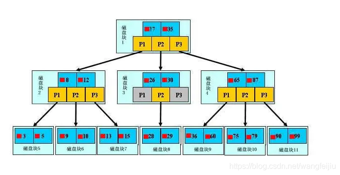

# 数据库
## RDBMS
- 事务
  - A. 事务的原子性(Atomicity)：指一个事务要么全部执行,要么不执行.也就是说一个事务不可能只执行了一半就停止了.比如你从取款机取钱,这个事务可以分成两个步骤:1划卡,2出钱.不可能划了卡,而钱却没出来.这两步必须同时完成.要么就不完成.
  - C. 事务的一致性(Consistency)：指事务的运行并不改变数据库中数据的一致性.例如,完整性约束了a+b=10,一个事务改变了a,那么b也应该随之改变.
  - I. 独立性(Isolation):事务的独立性也有称作隔离性,是指两个以上的事务不会出现交错执行的状态.因为这样可能会导致数据不一致.
  - D. 持久性(Durability):事务的持久性是指事务执行成功以后,该事务所对数据库所作的更改便是持久的保存在数据库之中，不会无缘无故的回滚.

- 索引
  - 索引是对数据库表中一列或多列的值进行排序的一种结构。
  - 优缺点
    - 索引大大减小了服务器需要扫描的数据量，从而大大加快数据的检索速度，这也是创建索引的最主要的原因。
    - 创建索引和维护索引要耗费时间和空间，这种时间随着数据量的增加而增加，对表中的数据进行增、删、改的时候，索引也要动态的维护。
  - 索引类型
    - B-Tree
      - 平衡树 Balanced Tree
      - 其搜索性能等价于在关键字全集内做一次二分查找；
      - 搜索有可能在非叶子结点结束；
      - 
    - B+Tree
      - 平衡树改良版本
      - 所有关键字都出现在叶子结点的链表中（稠密索引），且链表中的关键字恰好是有序的；
      - 非叶子结点相当于是叶子结点的索引（稀疏索引），叶子结点相当于是存储（关键字）数据的数据层；
      - 
    - Hash
      - 散列函数索引
      - 仅仅能满足"=",“IN"和”<=>"查询，不能使用范围查询。也不支持任何范围查询，例如WHERE price > 100。
      - 
```sql
-- SQL语句
-- 建表 CREATE TABLE
CREATE TABLE 表名
(
  列名1 数据类型 [列级完整性约束条件],
  ....
  列名n 数据类型 [列级完整性约束条件],
  表级完整性约束条件1,
  ...
  表级完整性约束条件n
);

-- 数据类型
CHAR(n) 长度为n的字符串
VARCHAR(n) 最大长度为n的变长字符串
NUMBER(n) 长度为n的数字型
INT 整型(4b)
BIGINT 长整型(8b)
SMALLINT 短整型(2b)
FLOAT(n) 精度位n位数字的浮点型
DATE 日期yyyy-mm-dd
TIME 时间HH:MM:SS
-- 列级完整性约束条件
PRIMARY KEY 主键，只有1个主码时可以直接写
NOT NULL 非空
UNIQUE 唯一
CHECK(条件)
-- 表级完整性约束条件
PRIMARY KEY(列名1, ..., 列名n)
FOREIGN KEY(列名1) REFERENCES 被参照表(列名1)

-- example of create table
CREATE TABLE Stu
(
  id int AUTO_INCREMENT,
  s_name varchar(20),
  mobile char(20),
  create_time datetime,
  update_time datetime,
  is_delete tinyint,
  PRIMARY KEY(id),
  FOREIGN KEY(id) REFERENCES CourseChosen(s_id)
);

-- 修改表 ALTER TABLE
-- 1.增加新的属性列
ALTER TABLE Stu ADD class_id int;
-- 2.增加列级完整性约束条件
ALTER TABLE Stu ADD UNIQUE(mobile);
-- 3.增加表级完整性约束条件
ALTER TABLE Stu ADD FOREIGN KEY(mobile) REFERENCES ContactInfo(mobile);
-- 4.删除列
ALTER TABLE Stu DROP class_id CASCADE; // 级联删除 引用该列的其他对象一起删
ALTER TABLE Stu DROP class_id RESTRICT; // 若该列被其他对象引用则拒绝删除
-- 5.删除列级完整性约束条件
ALTER TABLE Stu DROP CONSTRAINT UNIQUE(mobil) CASCADE;
ALTER TABLE Stu DROP CONSTRAINT UNIQUE(mobil) RESTRICT;
-- 6.修改列
ALTER TABLE Stu ALTER mobile phone varchar(20);


-- 建立索引
-- 1.建立唯一索引
CREATE UNIQUE INDEX ID_NAME ON Stu(id asc, s_name asc);
-- 2.建立聚簇索引
CREATE CLUSTER INDEX ID_NAME ON Stu(id asc, s_name asc);
-- 3.改索引名
Alter INDEX ID_NAME RENAME TO ID_NAME_RENAME;
-- 4.删索引
DROP INDEX ID_NAME;

-- 插入数据 INSERT INTO
INSERT INTO Stu(s_name, mobile) VALUES('qq', 185****9720);

-- 更新数据
UPDATE Stu SET s_name='qqq', mobile='11111111111' where id = 1;

-- 删除数据
DELETE FROM Stu WHERE id = 1;


-- 查询
-- 关键字排序
1、from 子句组装来自不同数据源的数据；
2、where 子句基于指定的条件对记录行进行筛选； 
3、group by 子句将数据划分为多个分组； 
4、使用聚集函数进行计算； 
5、使用 having 子句筛选分组； 
6、计算所有的表达式； 
7、select 的字段； 
8、使用 order by 对结果集进行排序。
9、offset,limit分页


-- 聚集函数
count(), count(distinct col),avg(), sum(), max(), min()

-- where条件表达式
where col in ('a', 'b', 'c')
where a between 0 and 10
where col > 1
where s_name like "刘%"


-- 集合查询
UNION 并
INTERSECT 交
EXCEPT 差
```
- 事务
- 封锁
  - X锁 排他锁
    - 写锁，事务对数据对象上锁后，可读取和修改该数据对象，其他事务不可再对该数据对象添加锁
  - S锁 共享锁
    - 读锁，某事物对数据对象上锁后，可读取但不可修改该数据对象，其他事务对该数据对象添加s锁，但不能添加x锁
- 封锁协议
  - 一级封锁协议
    - 写前加锁，事务结束释放写锁，防止丢失修改
  - 二级...
    - 写前加写锁，读前加读锁，读完释放读锁，事务结束释放写锁，防止丢失修改和读脏数据
  - 三级...
    - 写前加写锁，读前加读锁，事务结束释放各锁，可防止丢失修改、读脏数据和不可重复读


## Redis
- 内存数据库
- 可以持久化到硬盘
  - 触发命令
      - save 阻塞当前进程 进行持久化
      - bgsave 主进程fork一个子进程来执行RDB过程 完成后自动结束
  - 触发机制
      - 自动触发 
      - 配置redis.conf的自动触发条件
      - shutdown关闭时未开启AOF持久化功能，自动执行一次bgsave
      - 主从同步
      - 手动触发 
  - 持久化类型
      - RDB redis内存快照
        - 文件小 适合定时备份 用于灾难恢复 RDB加载速度也快
        - 实时性差 无法实时持久化 会阻塞进程
      - AOF日志
        - AOF日志是持续增量的备份，是基于写命令存储的可读的文本文件。AOF日志会在持续运行中持续增大，由于Redis重启过程需要优先加载AOF日志进行指令重放以恢复数据，恢复时间会无比漫长。所以需要定期进行AOF重写，对AOF日志进行瘦身。目前AOF是Redis持久化的主流方式。
        - AOF是文件操作，对于变更操作比较密集的server，那么将造成磁盘IO的负荷加重。此外linux对文件操作采取了“延迟写入”手段，即并非每次write操作都会触发实际磁盘操作，而是进入了buffer中，当buffer数据达到阀值时触发实际写入(也有其他时机)，这是linux对文件系统的优化。
        - 优点：AOF只是追加写日志文件，对服务器性能影响较小，速度比RDB要快，消耗的内存较少
        - 缺点：
            - AOF方式生成的日志文件太大，需要不断AOF重写，进行瘦身。
            - 即使经过AOF重写瘦身，由于文件是文本文件，文件体积较大（相比于RDB的二进制文件）。
            - AOF重演命令式的恢复数据，速度显然比RDB要慢。

  - 数据结构
<table>
    <thead><tr>
    <th>类型</th>
    <th>简介</th>
    <th>特性</th>
    <th>场景</th>
    </tr></thead>
    <tbody>
    <tr>
    <td>String(字符串)</td>
    <td>二进制安全</td>
    <td>可以包含任何数据,比如jpg图片或者序列化的对象,一个键最大能存储512M</td>
    <td>简单的缓存/ setnx 用来做简单的锁</td>
    </tr>
    <tr>
    <td>Hash(字典)</td>
    <td>键值对集合,即编程语言中的Map类型</td>
    <td>适合存储对象,并且可以像数据库中update一个属性一样只修改某一项属性值(Memcached中需要取出整个字符串反序列化成对象修改完再序列化存回去)</td>
    <td>存储、读取、修改用户属性</td>
    </tr>
    <tr>
    <td>List(列表)</td>
    <td>链表(双向链表)</td>
    <td>增删快,提供了操作某一段元素的API</td>
    <td>1,最新消息排行等功能(比如朋友圈的时间线) 2,消息队列</td>
    </tr>
    <tr>
    <td>Set(集合)</td>
    <td>哈希表实现,元素不重复</td>
    <td>1、添加、删除,查找的复杂度都是O(1) 2、为集合提供了求交集、并集、差集等操作</td>
    <td>1、共同好友 2、利用唯一性,统计访问网站的所有独立ip 3、好友推荐时,根据tag求交集,大于某个阈值就可以推荐</td>
    </tr>
    <tr>
    <td>Sorted Set(有序集合)</td>
    <td>将Set中的元素增加一个权重参数score,元素按score有序排列</td>
    <td>数据插入集合时,已经进行天然排序</td>
    <td>1、排行榜 2、带权重的消息队列</td>
    </tr>
    </tbody>
</table>

## MongoDB
- MongoDB 将数据存储为一个文档，数据结构由键值(key=>value)对组成。MongoDB 文档类似于 JSON 对象。字段值可以包含其他文档，数组及文档数组。
- 优缺点
  - Schema-less，不需要预先定义表结构，同一个“表”中可以保存多个格式的数据；数据支持嵌套，数据以json格式存储
  - Mongodb没有“数据一致性检查”、“事务”等，不适合存储对数据事务要求高（比如金融）的数据；只适合放非关键性数据（比如日志或者缓存）。关联查询很弱，不适合做报表查询
- 应用场景
  - 日志

## ObjectedRelationalMapping ORM
- 为了解决面向对象与关系数据库存在的互不匹配的现象的技术
- 对高级语言内部对象的操作可以转化为sql语句


# 统计学
- 总体与样本
  - 参数： 反应总体某种特征的量
  - 总体方差：$\sigma^2 = \frac{\sum_{i=1}^{n}(x_i-\bar x)^2}{n}$
  - 统计量： 反应样本某种特征的量
  - 样本方差：$S^2 = \frac{\sum_{i=1}^{n}(x_i-\bar x)^2}{n-1}$（自由度为n-1）
- 抽样方式
  - 概率抽样 按一定的概率以随机原则抽取样本（包括等概率与不等概率抽样）
    - 简单随机抽样 N个单位中随机抽取n个单位为样本，概率均等
    - 分层抽样 总体划分为若干层，根据层占总体的比例来进行各层的简单随机抽样
    - 整群抽样 整体中若干个单位合并为组，抽样时直接抽群
    - 系统抽样 按一定排序规则来抽样
    - 多阶段抽样 有n个阶段 每个阶段采取一次抽样方法
  - 非概率抽样
    - 方便抽样 怎么方便怎么来
    - 判断抽样 经验驱动
    - 自愿样本 
    - 滚雪球抽样 类似传销
    - 配额抽样 分层后采用方便/判断抽样
- 数据的误差
  - 抽样误差 随机原因
  - 非抽样误差 非随机原因
- 数据分布特征
  - 集中趋势
    - 众数
    - 中位数
    - 均值
  - 离散程度
    - 异众比率 不同于众数的比率
    - 四分位差
    - 方差和标准差
    - 离散系数 标准差/均值
      - $V_\sigma = \frac{\sigma}{\bar{X}}$
      - $V_S=\frac{S}{\bar{X}}$
      - 离散系数越小 离散程度越小
  - 分布的形状
    - 偏态
      - =0 对称分布
      - \>0 右偏分布
      - <0 左偏分布
    - 峰度
      - =3 扁平程度适中
      - <3 扁平分布
      - \>3 尖峰分布
## 单总体参数估计
<table>
    <thead><tr>
      <th>待估参数</th>
      <th>样本大小</th>
      <th>σ<sup>2</sup></th>
      <th>适用分布</th>
    </tr></thead>
    <tbody>
    <tr>
      <td>均值</td>
      <td>大样本</td>
      <td>σ<sup>2</sup>已知</td>
      <td>Z分布</td>
    </tr>
    <tr>
      <td>均值</td>
      <td>小样本</td>
      <td>σ<sup>2</sup>已知</td>
      <td>Z分布</td>
    </tr>
    <tr>
      <td>均值</td>
      <td>大样本</td>
      <td>σ<sup>2</sup>未知</td>
      <td>Z分布</td>
    </tr>
    <tr>
      <td>均值</td>
      <td>小样本</td>
      <td>σ<sup>2</sup>未知</td>
      <td>t分布</td>
    </tr>
    <tr>
      <td>比例</td>
      <td>大样本</td>
      <td>/</td>
      <td>Z分布</td>
    </tr>
    <tr>
      <td>方差</td>
      <td>/</td>
      <td>/</td>
      <td>卡方分布</td>
    </tr>
    </tbody>
</table>

- 总体均值的区间估计-大样本
  1. 假定条件
       - 总体服从正态分布，且方差已知
       - 如果不是正态分布，可由正态分布来近似(n>=30)
  2. 使用正态分布统计量z (z分布)
       - $z=\frac{\bar{x}-\mu}{\sigma/\sqrt{n}}\sim N(0,1)$
  3. 总体均值$\mu$在$1-\alpha$置信水平下的置信区间为
       - 均值±统计量*标准差
       - $\bar{x}±Z_{\alpha/2}\frac{\sigma}{\sqrt{n}}$
       - $\bar{x}±Z_{\alpha/2}\frac{S}{\sqrt{n}}(\sigma 未知)$
- 总体均值的区间估计-小样本
  1. 假定条件
       - 总体服从正态分布，但方差$\sigma^2$未知
       - 小样本(n<30)
  2. 使用t分布统计量
       - $t=\frac{\bar{x}-\mu}{s/\sqrt{n}}\sim t(n-1)$
  3. 总体均值$\mu$在$1-\alpha$置信水平下的置信区间为
       - 均值±统计量*标准差
       - $\bar{x}±t_{\alpha/2}\frac{S}{\sqrt{n}}$
- 总体比例的区间估计
  1. 假定条件
     - 大样本 np>=5 and n(1-p)>=5
     - 总体服从二项分布 
     - 可以由正态分布来近似
  2. 使用正态分布统计量z
     - $z=\frac{p-\pi}{\sqrt{\frac{\pi(1-\pi)}{n}}}$
  3. 总体比例$\pi$在$1-\alpha$置信水平下的置信区间为
     - $p±z_{\alpha/2}\sqrt{\frac{p(1-p)}{n}}$ 
- 总体方差的区间估计
  1. 估计一个总体的方差或标准差
  2. 假设总体服从正态分布
  3. 总体方差$\sigma^2$的点估计量为$S^2$，且
     - $\frac{(n-1)s^2}{\sigma^2}\sim\chi^2(n-1)$
     - $\frac{(n-1)s^2}{\chi_{\alpha/2}^2(n-1)}\le \sigma^2 \le \frac{(n-1)s^2}{\chi_{1-\alpha/2}^2(n-1)}$
## 双总体参数估计
- 两个总体均值之差的区间估计-大样本
  1. 假定条件
       - 两个总体服从正态分布，且$\sigma_1,\sigma_2$已知
       - 如果不是正态分布，可由正态分布来近似(n1>=30 n2>=30)
       - 两个样本是独立的随机样本
  2. 使用正态分布统计量z (z分布)
       - $z=\frac{(\bar{x_1}-\bar{x_2})-(\mu_1-\mu_2)}{\sqrt{\frac{\sigma^2_1}{n_1}+\frac{\sigma^2_2}{n_2}}}\sim N(0,1)$
  3. 置信区间
       - $(\bar{x_1}-\bar{x_2})±Z_{\alpha/2}{\sqrt{\frac{\sigma^2_1}{n_1}+\frac{\sigma^2_2}{n_2}}}$
       - $(\bar{x_1}-\bar{x_2})±Z_{\alpha/2}{\sqrt{\frac{S^2_1}{n_1}+\frac{S^2_2}{n_2}}}$
- 两个总体均值之差的估计-小样本
  1. 假定条件
       - 两个总体都服从正态分布
       - 方差未知但相等:$\sigma^2_1=\sigma^2_2$
       - 小样本(n1<30和n2<30)
  2. 总体方差的合并估计量
       - $s^2_p=\frac{(n_1-1)s^2_1+(n_2-1)s^2_2}{n1+n2-2}$
  3. 估计量$\bar x_1 - \bar x_2$的抽样标准差
       - $\sqrt{\frac{s^2_p}{n_1}+\frac{s^2_p}{n_2}}=s_p\sqrt{\frac{1}{n_1}+\frac{1}{n_2}}$
  4. 置信区间
     - $(\bar{x_1}-\bar{x_2})±t_{\alpha/2}(n_1+n_2-2)\sqrt{s_p^2(\frac{1}{n_1}+\frac{1}{n_2})}$ 
- 两个总体均值之差的估计-小样本 方差不相等
  1. 假定条件
       - 两个总体都服从正态分布
       - 方差未知但不相等:$\sigma^2_1\neq\sigma^2_2$
       - 小样本(n1<30和n2<30)
  2. 使用t分布 t(v) v为自由度
  3. 置信区间
     - $(\bar{x_1}-\bar{x_2})±t_{\alpha/2}(v)\sqrt{s_p^2(\frac{1}{n_1}+\frac{1}{n_2})}$
- 两个总体方差比的区间估计
  1. 比较两个总体的方差比
  2. 用两个样本的方差比来判断
      - 如果比值接近1，说明两个总体方差很接近，反之存在差异
  3. 置信区间
      - $\frac{s_1^2/s_2^2}{F_{\alpha/2}}\le\frac{\sigma_1^2}{\sigma_2^2}\le\frac{s_1^2/s_2^2}{F_{1-\alpha/2}}$
- 估计总体均值时样本量的确定
  - $n=\frac{(z_{\alpha/2}^2\sigma^2)}{E^2}$
  - $E=z_{\alpha/2}\frac{\sigma}{\sqrt(n)}$
## 假设检验
- 原假设选择
- 显著性水平$\alpha$
  - 0.1 0.05 0.01
- P值
  - 左侧检验时P为小于等于检验统计量值的曲线下方的面积
  - 右侧检验时P为大于等于检验统计量值的曲线下方的面积
  - 双侧检验时P为绝对值大于等于检验统计量值的绝对值的曲线下方的面积
  - 单侧检验p值跟$\alpha$做比较
  - 双侧检验p值跟$\alpha/2$做比较
- 步骤
  - 提出原假设和备择假设
  - 构建检验统计量及确定其分布
  - 选择显著性水平，确定临界值
  - 计算检验统计量和P值
  - 给出检验结论及统计决策
- 两类错误
<table>
    <thead><tr>
      <th>原假设</th>
      <th>结论</th>
      <th>错误类型</th>
    </tr></thead>
    <tbody>
    <tr>
      <td>真实</td>
      <td>接受原假设</td>
      <td>X</td>
    </tr>
    <tr>
      <td>不真实</td>
      <td>拒绝原假设</td>
      <td>X</td>
    </tr>
    <tr>
      <td>真实</td>
      <td>拒绝原假设</td>
      <td>第一类错误-弃真</td>
    </tr>
    <tr>
      <td>不真实</td>
      <td>接受原假设</td>
      <td>第二类错误-取伪</td>
    </tr>
    </tbody>
</table>

## 方差分析
- 基本假定
  - 每个总体服从正态分布
  - 每个总体方差必须相同
  - 观察值独立
- 两类误差
  - 随机误差
    - 因素的统一水平(总体)下，样本各观察值之间的差异
    - 比如，同一行业下不同企业被投诉次数是不同的
    - 随机因素造成的影响
  - 系统误差
    - 因素的不同水平(不同总体)下，各观察值之间的差异
    - 比如，不同行业之间被投诉次数之间的差异
    - 由于抽样的随机性造成的，也可能是由于行业本身造成的，后者是由系统性因素造成的，称为系统误差
    - 组间误差/组内误差的比值大到某种程度时，可以说不同水平之间存在显著差异
- 总误差平方和 SST = SSA + SSE
  - 全部观察值与总平均值的离差平方和
  - $SST=\sum_{i=1}^k\sum_{j=1}^{n_i}(x_{ij}-\bar{\bar{x}})^2$
- 水平项平方和 SSA
  - 各组平均值与总平均值的离差平方和 [组间平方和] [组间方差]
  - $SSA=\sum_{i=1}^{k}{n_i}(\bar{x_i}-\bar{\bar{x}})^2$
- 误差项平方和 SSE
  - 每个水平或组的各样本数据与其组平均值的离差平方和 [组内平方和] [组内方差]

  - $SSE=\sum_{i=1}^k\sum_{j=1}^k(x_{ij}-\bar{x_i})^2$
- 检验统计量：三个平方和的作用
  - SST 反映全部数据总的误差程度
  - SSA 反映随机误差大小
  - SSE 反映随机误差和系统误差的大小
  - 如果原假设成立，则没有系统误差，组间平方和SSA除以自由度后的均方与组内平方和SSE除以自由度后的军方差异就不会太大，如果组间均方显著地大于组内均方，说明各水平(总体)不仅有随机误差，还有系统误差
- 自由度
  - SST n-1, n为全部观察值个数
  - SSA k-1, k为因素水平（总体）的个数
  - SSE n-k
- 组内方差
  - 只有随机误差
  - $MSA=\frac{SSA}{k-1}$
- 组间方差
  - 随机误差+系统误差
  - $MSE=\frac{SSE}{n-k}$
- F统计量
  - $F=\frac{MSA}{MSE}\sim F(k-1, n-k)$
- 关系强度的测量
  - 自变量平方和占总平方和的比例记为$R^2$
  - $R^2=\frac{SSA(组间平方和)}{SST(总平方和)}$
  - 适用于分类数据的相关性分析

<table>
    <thead><tr>
      <th>误差来源</th>
      <th>平方和SS</th>
      <th>自由度df</th>
      <th>均方MS</th>
      <th>F值</th>
      <th>P值</th>
      <th>F临界值</th>
    </tr></thead>
    <tbody>
    <tr>
      <td>组间（因素影响）</td>
      <td>SSA</td>
      <td>k-1</td>
      <td>MSA</td>
      <td>MSA/MSE</td>
      <td></td>
      <td></td>
    </tr>
    <tr>
      <td>组内（误差）</td>
      <td>SSA</td>
      <td>n-k</td>
      <td>MSE</td>
      <td></td>
      <td></td>
      <td></td>
    </tr>
    <tr>
      <td>综合</td>
      <td>SST</td>
      <td>n-1</td>
      <td></td>
      <td></td>
      <td></td>
      <td></td>
    </tr>
</table>

## 相关与回归
- 相关系数
  - 总体相关系数$\rho$
  - 样本相关系数r
- 回归模型
  - 1个数字的因变量(响应变量 被预测的变量)
  - 1个或多个数字的或分类的自变量(解释变量 用于预测的变量)
- 一元线性回归模型
  - $y=\beta_0+\beta_1+\varepsilon$
  - 估计的回归方程: $\hat{y}=\hat{\beta_0}+\hat{\beta_1}x$
- 最小二乘估计
  - $\sum_{i=1}^n(y_i-\hat y)^2=\sum_{i=1}^n(y_i-\hat{\beta_0}-\hat{\beta_1x_i})=最小$
  - 求解最小时的参数取值:
    - $\hat{\beta_1}=\frac{n\sum_{i=1}^{n}x_iy_i-(\sum_{i=1}^{n}x_i)(\sum_{i=1}^{n}y_i)}{n\sum_{i=1}^{n}x_i^2-(n\sum_{i=1}{n}x_i)^2}$
    - $\hat{\beta_0}=\bar{y}-\hat{\beta_1}{\bar{x}}$
- 离差平方和的分解
  - 总平方和 SST = SSR + SSE
    - $\sum_{i=1}^n(y_i-\bar{y})^2$
  - 回归平方和 SSR
    - $\sum_{i=1}^n(\hat{y_i}-\bar{y})^2$
  - 残差平方和 SSE
    - $\sum_{i=1}^n({y_i}-\hat{y})^2$
- 判定系数$r^2$
  - $R^2=\frac{SSR}{SST}$
  - 反应回归直线的拟合程度
  - 取值范围在[0,1]之间
  - 越趋近于1，拟合的越好，趋近于0，说明回归方程拟合的越差
  - 相关系数$r=\sqrt{R^2}$
- 估计标准差
  - $S_y = \sqrt{MSE}$
- 回归系数的检验

## 时间序列
- 分类
  1. 平稳序列 随机，不存在某种规律
  2. 非平稳序列 有趋势的序列
- 成分
  - 趋势
    - 线性趋势
    - 非线性趋势
  - 季节性
  - 周期性
  - 随机性
- 直线趋势方程
  - 求出Y关于t(时间)的回归方程


# 机器学习
## 相关性分析 R^2
## 线性回归

### 最小二乘法
### 梯度下降法

## 激活函数

## 优化函数

## 人工神经网络
## logistic线性回归

## kmeans

## 决策树

## 随机森林


# 高级语言
## 面向对象特性
## Python特性
https://github.com/bokunopica/fullstack_py_learn_note/blob/master/%E5%9F%BA%E7%A1%80/python%E5%9F%BA%E7%A1%80%2B.md
## Java特性

## Javascript
# 操作系统应用
## linux指令
# 设计模式

# 计算机网络